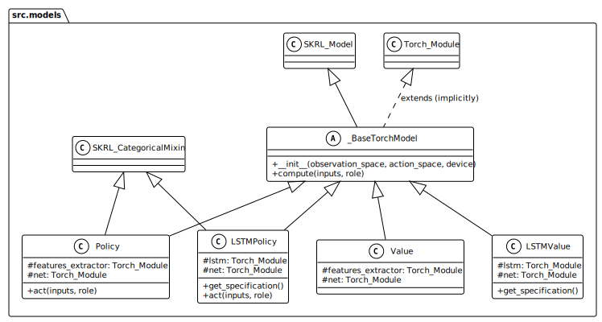
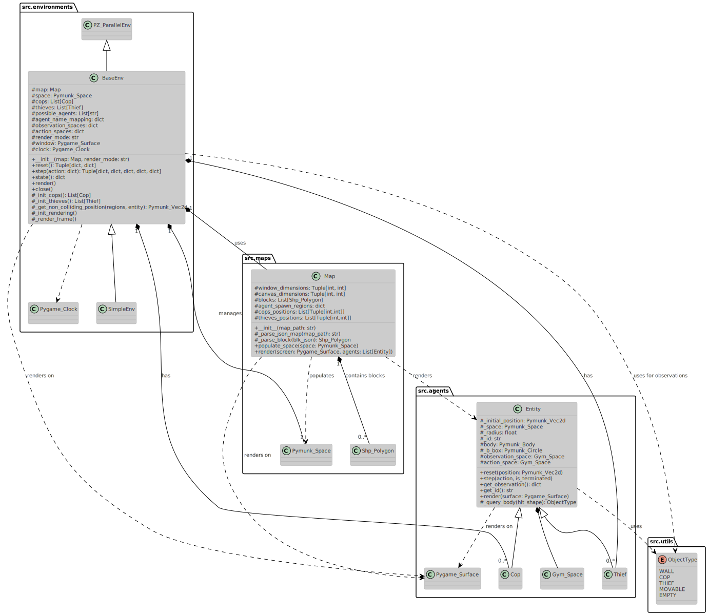
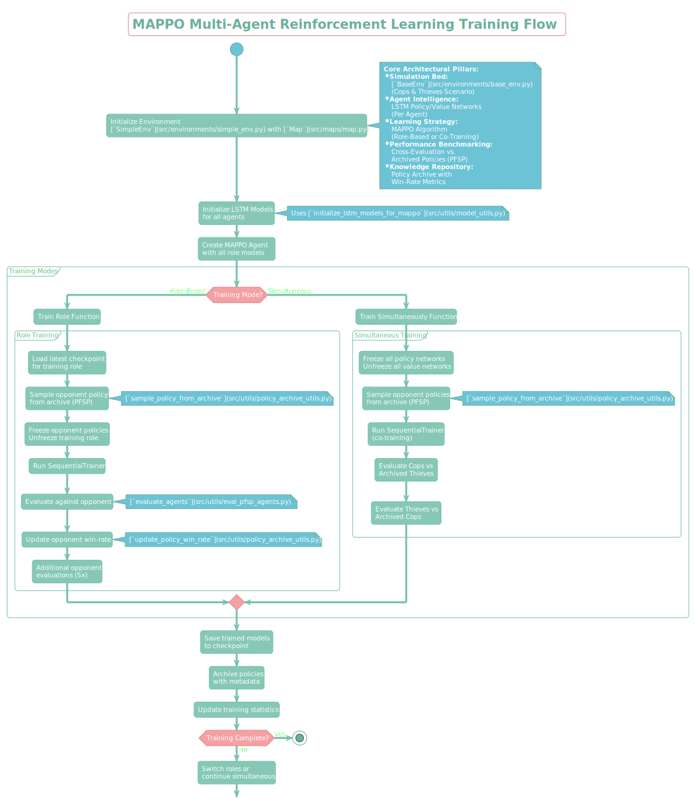
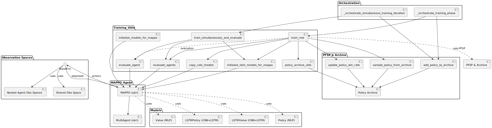

# Introduction

This report provides an overview of the project, including its objectives, methodology, and results. The project aims to develop environment-agnostic agents for a "Cops and Thieves" pursuit-evasion game, leveraging advanced multi-agent reinforcement learning techniques.

**Code repository**: [github.com/Hevagog/as-cops-and-thieves](https://github.com/Hevagog/as-cops-and-thieves)

# Goal of the project 

The main goal of this project is to train *environment-agnostic* agents:

-   ***Cops***: To search and chase thieves. If multiple cops are present, they should exhibit cooperative behavior.
-   ***Thief***: To hide and evade capture efficiently.

A key aspect for both agent types is their ability to analyze their surroundings and make decisions based on past observations. Initially, the project focuses on a scenario with one cop and one thief, with the potential to increase the number of cop agents to observe emergent cooperative behaviors and more sophisticated search patterns.

The research question revolves around achieving intelligent pursuit and evasion behaviors in a multi-agent system through reinforcement learning, specifically addressing how agents can learn to adapt to dynamic environments and opponent strategies.

# State of the art description, literature review, and related work

The project draws inspiration from existing research in multi-agent reinforcement learning (MARL) and self-play mechanisms (e.g. [@lin2023tizeromasteringmultiagentfootball; @selfplay_survey]). MARL extends single-agent reinforcement learning to scenarios with multiple agents, introducing challenges such as non-stationarity of the environment from each agent's perspective, coordination, communication, and equilibrium selection. Self-play, where an agent learns by interacting with copies or past versions of itself, has emerged as a powerful technique to address some of these challenges, promising more stable and manageable learning processes.

Notably, the work by OpenAI on emergent tool use in multi-agent environments [@baker2020emergenttoolusemultiagent] serves as a benchmark, highlighting the potential for complex behaviors to arise from learned policies. In their hide-and-seek game within a 3D physics-based environment, agents developed a self-supervised autocurriculum leading to multiple distinct rounds of emergent strategies, including sophisticated tool use and coordination. For instance, hiders learned to build shelters using movable boxes, and seekers, in turn, discovered how to use ramps to overcome these obstacles. Their approach utilized agent policies composed of two separate networks (a policy network and a critic network) optimized using Proximal Policy Optimization (PPO) and Generalized Advantage Estimation (GAE). The policy architecture was entity-centric, using self-attention mechanisms to process observations of other entities and the environment. This work demonstrated that multi-agent competition can lead to human-relevant skills emerging without explicit incentives for tool interaction.

Our approach incorporates Fictitious Self-Play (FSP) [@FictitiousSelfPlay], a technique where agents train against a distribution of past policies of their opponents, rather than just the latest version. This method is designed to improve training efficiency and stability in games. This contrasts with simpler self-play methods, like vanilla self-play where agents train only against their most recent version, or training against a fixed opponent. More advanced self-play strategies, such as Prioritized Fictitious Self-Play (PFSP), select opponents from a pool based on specific criteria, like their perceived strength, to further enhance training. 

The Multi-Agent Proximal Policy Optimization (MAPPO) algorithm [@mappo] is a key component in our project, known for its effectiveness in cooperative multi-agent settings. MAPPO, an on-policy algorithm, has demonstrated surprisingly strong performance and sample efficiency compared to popular off-policy methods in various cooperative multi-agent benchmarks like the StarCraft multi-agent challenge (SMAC), Google Research Football (GRF), and the Hanabi challenge. It typically employs a centralized training with decentralized execution (CTDE) paradigm, where a centralized value function (critic) has access to global information during training, while individual agent policies (actors) operate based on local observations during execution. Parameter sharing among homogeneous agents is a common practice with MAPPO, shown to improve learning efficiency. The MAPPO paper also highlights several implementation factors crucial for its performance, such as value normalization, appropriate input representation for the value function (including both global and local agent-specific features), careful management of training data usage (e.g., number of epochs and mini-batches), PPO clipping parameters, and batch size. These findings suggest that well-configured PPO-based methods can serve as strong baselines in cooperative MARL.

# Used model, methods, tools, and techniques

## The agents

**Agent Types**:

-   *Cops*: Seek to find and "arrest" thieves.
-   *Thieves*: Aim to avoid cops and "survive" for as long as possible.

**Interactions**: Agents operate in a shared 2D environment. Cops' success is defined by catching a thief, while thieves' success is defined by evading cops. Interactions are governed by the physics engine and the agents' learned policies.

## The models

**Models development**:

-   **Initial Models**: Multi-Layer Perceptrons (MLPs) were used for both policy and value networks.
-   **CNN Integration**: Recognizing the spatial nature of observations, Convolutional Neural Networks (CNNs) were introduced for the policy network, with distinct channels for agent-specific and shared observations. This CNN typically acts as a `features_extractor`.
-   **LSTM Implementation**: To incorporate memory and allow agents to act based on past observations, Long Short-Term Memory (LSTM) networks were integrated into the policy and value networks. The policy network utilizes `CategoricalMixin` from `skrl` [@skrl] for stochastic, categorical actions, while the value network uses `DeterministicMixin`.

**Neural Network Architecture**:

The neural network architectures for agent policies and value functions are structured as follows, all inheriting from a base model class which itself is an extension of `skrl.models.torch.Model` and implicitly `torch.nn.Module`. Our solution, presented in [@fig:class-model], includes the following key classes:

{#fig:class-model width=60%}

*   **`_BaseTorchModel`**: An abstract base class that standardizes the interface for all policy and value network models. It inherits from `skrl.models.torch.Model`, providing fundamental compatibility with the skrl framework, and by extension, `torch.nn.Module` for PyTorch functionalities. It defines a common `compute` method for forward passes and an `__init__` method to handle observation and action spaces.

*   **`Policy`**: Represents a standard policy network. It extends `_BaseTorchModel` and `CategoricalMixin` (for discrete action spaces). This model typically incorporates a `features_extractor` (e.g., a CNN to process spatial observation data like raycasts) followed by a `net` (e.g., an MLP) that outputs action probabilities. The `act` method is used to sample actions based on observations.

*   **`Value`**: Represents a standard value network, used by the critic in actor-critic algorithms. It extends `_BaseTorchModel`. Similar to the `Policy` model, it often uses a `features_extractor` (CNN) to process observations and a `net` (MLP) to output a scalar state-value. As per the skrl framework, value networks for MAPPO typically use `skrl.models.torch.DeterministicMixin` when a continuous output (the value) is expected, although not explicitly shown as a direct inheritance in this diagram for this specific class.

*   **`LSTMPolicy`**: An extension of the `Policy` model that incorporates recurrent layers to maintain memory of past observations. It extends `_BaseTorchModel` and `skrl.models.torch.CategoricalMixin`. It includes an `lstm` layer for processing sequences of features, followed by a `net` (MLP) for action probability outputs. In practice, a CNN-based `features_extractor` (as seen in `lstm_policy_net.py`) processes raw observations before they are fed as a sequence to the LSTM. The `get_specification` method provides RNN-specific details to the skrl framework, and `act` samples actions.

*   **`LSTMValue`**: An extension of the `Value` model incorporating recurrent layers. It extends `_BaseTorchModel` and, as implemented in `lstm_value_net.py`, `skrl.models.torch.DeterministicMixin`. It features an `lstm` layer and a subsequent `net` (MLP) to output the state-value. Similar to `LSTMPolicy`, a CNN-based `features_extractor` typically preprocesses observations before LSTM input. It also implements `get_specification` for RNN configuration.

## Architecture Overview

The project's environment and agent architecture are depicted in the class diagram [@fig:class-env]. The core components are organized into several packages: `src.agents`, `src.maps`, `src.environments`, and `src.utils`.

{#fig:class-env width=100%}

### **Agent (`src.agents`)**

*   **`Entity`**: This is the base class for all agents within the simulation. It encapsulates common functionalities such as physics-based movement (via a `Pymunk.Body` and `Pymunk.Circle` for collision), definition of `action_space` and `observation_space` (using `gym.spaces`), and methods for agent lifecycle management like `reset()` to initial or specified positions, `step()` to process an action and return observations/rewards, and `get_observation()` which performs raycasting to perceive the environment. It also interacts with `src.utils.ObjectType` to classify detected objects.
*   **`Cop`**: This class extends `Entity` and represents the pursuing agents. It inherits the base functionalities and can have specialized behaviors or reward structures tailored for chasing and capturing thieves.
*   **`Thief`**: This class also extends `Entity` and represents the evading agents. Similar to `Cop`, it inherits from `Entity` and can implement specific logic for evasion and survival.

### **Map (`src.maps`)**

*   **`Map`**: This class is responsible for loading and defining the game world. It parses map configurations from JSON files, which include details about `window_dimensions`, `canvas_dimensions`, static obstacles (`blocks` represented as `Shp_Polygon`), and initial agent positions (`cops_positions`, `thieves_positions`) as well as `agent_spawn_regions`. Its `populate_space()` method adds these static elements to the Pymunk physics `space`. It also includes a `render()` method for visualization.

### **Environment (`src.environments`)**

*   **`BaseEnv`**: This is the central class orchestrating the multi-agent simulation, inheriting from PettingZoo's `ParallelEnv` to ensure compatibility with MARL frameworks. It initializes and manages the `Map`, the Pymunk `space`, and lists of `Cop` and `Thief` agents. Key responsibilities include:
    *   Initializing agents at appropriate, non-colliding positions using `_get_non_colliding_position()`.
    *   Managing the main simulation loop through its `step()` method, which takes actions from all agents, updates the physics, calculates rewards, and checks for termination conditions.
    *   Providing `observation_spaces` and `action_spaces` for each agent.
    *   Handling rendering via Pygame (`_init_rendering()`, `_render_frame()`).
    *   Providing the overall `state()` of the environment.
*   **`SimpleEnv`**: This class extends `BaseEnv`, likely providing a specific configuration or a simpler version of the environment, though its specific overrides are not detailed in the diagram.

### **Utilities (`src.utils`)**

*   **`ObjectType`**: An enumeration used by agents (specifically within the `Entity` class's `_query_body()` method) to classify objects detected through raycasting, such as `WALL`, `COP`, `THIEF`, `MOVABLE`, or `EMPTY`. This is crucial for agents to understand their surroundings.

### **Interactions and Dependencies:**

The simulation's architecture is built upon a set of interconnected components, with `BaseEnv` serving as the primary orchestrator.

*   **Central Orchestration (`BaseEnv`)**:
    *   The `BaseEnv` class is central to the simulation. It initializes and holds an instance of the `Map` class, which defines the static environment, including obstacles and agent spawn configurations.
    *   `BaseEnv` manages the lifecycle of `Cop` and `Thief` agents (which are instances of `Entity`). It initializes them, places them in the environment (potentially using `_get_non_colliding_position` based on `Map`'s `agent_spawn_regions`), and calls their respective `reset()` and `step()` methods.
    *   It owns and manages the `Pymunk.Space`, which is the physics world where all interactions occur. The `Map` populates this space with static bodies, and each `Entity` adds its own dynamic body to it.
    *   `BaseEnv` is responsible for the main simulation loop. In each step, it collects actions from all agents, directs agents to perform these actions, advances the Pymunk `space` simulation by a `time_step`, gathers new observations and rewards from agents, and checks for termination conditions (e.g., a cop catching a thief, or `max_step_count` reached).

*   **Agent-Environment Interaction (`Entity`, `Cop`, `Thief` & `Pymunk.Space`)**:
    *   All `Entity` objects (Cops and Thieves) are physical entities within the Pymunk `space`. Their movement is governed by physics: actions translate to forces/impulses applied to their `Pymunk.Body`, and collisions are handled by Pymunk.
    *   Agents perceive their environment through raycasting. The `Entity.get_observation()` method performs multiple `segment_query_first` calls within the `Pymunk.Space` to detect nearby objects.
    *   The `utils.ObjectType` enumeration is crucial for perception. When a raycast hits an object, the `Entity._query_body()` method determines the type of the hit `Pymunk.Shape` (e.g., `WALL`, `COP`, `THIEF`) based on its properties (like `body_type` or `filter.categories`). This classified information forms part of the agent's observation.
    *   Specific agent types (`Cop`, `Thief`) implement their own `reward()` functions, which often depend on the `ObjectType` detected in their observations (e.g., a Cop gets a positive reward for seeing a Thief nearby).

*   **MARL Framework Integration (`PettingZoo`, `Gymnasium`)**:
    *   `BaseEnv` inherits from `PettingZoo.ParallelEnv`, adhering to its API for multi-agent environments. This ensures compatibility with MARL algorithms and libraries like `skrl`.
    *   `Entity` defines its `action_space` and `observation_space` using `gymnasium.spaces`. `BaseEnv` aggregates these for all agents and also defines `shared_observation_spaces` and a global `state_space`, which are essential for centralized training approaches like MAPPO. The `get_shared_observations` function in `environments.observation_spaces` likely constructs these shared views.

*   **Visualization (`Pygame`)**:
    *   Rendering is handled by `Pygame`. `BaseEnv` contains methods like `_init_rendering()` and `_render_frame()`.
    *   When in "human" render mode, `BaseEnv` uses `Pymunk.pygame_util.DrawOptions` to draw the state of the `Pymunk.Space` (including agents and map obstacles) onto a `Pygame.Surface` (the game window).
    *   The `Map` class also has a `render()` method, suggesting it can draw static map elements, though `BaseEnv` primarily uses Pymunk's debug draw for dynamic content.

*   **External Libraries**:
    *   The system fundamentally relies on `Pymunk` for 2D physics simulation.
    *   `Gymnasium` (specifically `gym.spaces`) is used to define the structure of agent observations and actions.
    *   `PettingZoo` provides the multi-agent environment API.
    *   `Pygame` is used for rendering and visualization.
    *   `skrl` is the chosen library for implementing MARL algorithms (e.g., MAPPO), interacting with the `PettingZoo` environment.

*   **Configuration and Driving Scripts**:
    *   Scripts like `self_play_driver.py` show that the system's execution (training, evaluation) is driven by configurations (e.g., `TrainingConfig`, `CFG_AGENT`, `CFG_TRAINER`) that dictate parameters for the environment, agents, and learning process.

# Technical description

## Language, libraries, tools, and techniques

-   **Programming Language**: Python.
-   **Core Libraries**:
    -   **skrl** [@skrl]: For Multi-Agent Reinforcement Learning (MARL) implementation, specifically MAPPO.
    -   **PettingZoo**: To ensure MARL environment standards, compliant with the `Parallel API`.
    -   **pymunk**: As the 2D physics engine.
    -   **pygame**: For visualization of the environment and agent interactions.
-   **Techniques**:
    -   **MAPPO (Multi-Agent Proximal Policy Optimization)**: The primary RL algorithm used for training agents.
    -   **Self-Play**:
        -   Initial naive self-play was attempted but found insufficient.
        -   **Sampled Self-Play**: Agents were trained in cycles, sampling opponents from a pool of previously trained agents.
        -   **Prioritized Fictitious Self-Play (PFSP)**: Implemented to improve training efficiency by sampling opponents based on performance metrics (e.g., win rate closest to 50%), coupled with population-play validation.
    -   **Observation Space**: Implemented using a vision controller (ray casting). Shared observation spaces are used for agents of the same type.
    -   **Reward Function**: Iteratively refined for both cop and thief agents to encourage desired behaviors and scaled between -1 and 1, as detailed in [`docs/slides/src/23-progress-report-4.md`](docs/slides/src/23-progress-report-4.md).
    -   **Spawn Regions**: Introduced to diversify agent starting positions and reduce overfitting \
        ([`docs/slides/src/22-progress-report-3.md`](docs/slides/src/22-progress-report-3.md)).

## Training and Evaluation

The training and evaluation of agents in this project are centered around the Multi-Agent Proximal Policy Optimization (MAPPO) algorithm, leveraging a self-play paradigm, specifically Fictitious Self-Play (FSP) and its prioritized variant (PFSP), to foster robust policy development for both Cop and Thief agents. The overall process is designed to iteratively improve agent performance through interaction with past versions of opponent policies stored in an archive.

The core architectural pillars underpinning the training process include:

*   **Simulation Bed**: The [`BaseEnv`](src/environments/base_env.py) (specifically `SimpleEnv`) provides the Cops & Thieves scenario.
*   **Agent Intelligence**: LSTM-based Policy and Value Networks are used for each agent, enabling them to learn from sequences of observations.
*   **Learning Strategy**: The MAPPO algorithm is employed, supporting both role-based training and simultaneous co-training of all agents.
*   **Performance Benchmarking**: Cross-evaluation against archived policies (PFSP) is a key component for measuring progress and selecting opponents.
*   **Knowledge Repository**: A Policy Archive maintains trained policies along with their win-rate metrics against various opponents.

The general training flow, as depicted in the activity diagram [@fig:training-flow], outlines the iterative process:

{#fig:training-flow width=100%}

1.  **Initialization**:
    *   The environment ([`SimpleEnv`](src/environments/simple_env.py) utilizing a [`Map`](src/maps/map.py)) is initialized.
    *   LSTM-based models (Policy and Value networks, e.g., [`LSTMPolicy`](src/models/lstm_policy_net.py) and [`LSTMValue`](src/models/lstm_value_net.py)) are initialized for all agents. This step often involves utility functions like `initialize_lstm_models_for_mappo` from `src.utils.model_utils.py`.
    *   A MAPPO agent instance (from the `skrl` library) is created, incorporating the models for all agent roles.

2.  **Training Modes**: The system supports two primary training modes:
    *   **Role-Based Training**:
        *   One role (e.g., Cops) is actively trained while the other role (e.g., Thieves) uses a fixed policy sampled from the opponent's policy archive.
        *   The process involves:
            1.  Loading the latest checkpoint for the role being trained.
            2.  Sampling an opponent policy from the archive using PFSP principles (e.g., via \
                `sample_policy_from_archive` in `src.utils.policy_archive_utils.py`).
            3.  Freezing the parameters of the opponent's policy and value networks, while unfreezing those of the training role.
            4.  Running the `skrl.trainers.SequentialTrainer` to update the training role's models.
            5.  Evaluating the newly trained policy against the sampled opponent (e.g., using \
                `evaluate_agents` from `src.utils.eval_pfsp_agents.py`).
            6.  Updating the win-rate of the sampled opponent policy in the archive based on the evaluation outcome (e.g., using `update_policy_win_rate`).
            7.  Optionally, performing additional evaluations against other archived opponents.
    *   **Simultaneous Training (Co-training)**:
        *   All agents (Cops and Thieves) are trained concurrently.
        *   The process involves:
            1.  Optionally, policies from the archive can be sampled as opponents for evaluation or to guide training, though the primary training is against the concurrently learning agents.
            2.  Running the `SequentialTrainer` to co-train all agents' policies and value functions.
            3.  Evaluating the performance of Cops against a set of archived Thief policies and Thieves against archived Cop policies.

3.  **Post-Training Steps (per iteration)**:
    *   The trained models (for all agents or the specific role) are saved to a checkpoint file.
    *   The newly trained policies are added to their respective archives (Cop archive, Thief archive) along with relevant metadata such as the training iteration and win-rates.
    *   Overall training statistics (e.g., average rewards, episode lengths) are updated and logged.

4.  **Loop Continuation**:
    *   The training loop continues until a predefined number of iterations or another completion criterion is met.
    *   In role-based training, roles might be switched for the next iteration. In simultaneous training, the process simply continues.

The orchestration of this training flow and the interaction between different software components are illustrated in the component diagram [@fig:orchestration-training-flow]:

{#fig:orchestration-training-flow width=100%}

*   **Orchestration Layer**:
    *   High-level functions like `_orchestrate_training_phase` (for role-based) and \
        `_orchestrate_simultaneous_training_iteration` (for simultaneous, as seen in [`self_play_driver.py`](src/self_play_driver.py)) manage the overall training iterations.
    *   These orchestrators call specific training utility functions and handle the archiving of policies.

*   **Training Utilities (`Training_Utils`)**:
    *   Functions like `train_role` and `train_simultaneously_and_evaluate` encapsulate the logic for the respective training modes.
    *   They interact with model initialization helpers (e.g., `initialize_lstm_models_for_mappo`), evaluation functions (`evaluate_agents`, `evaluate_agent`), and the policy archive utilities.

*   **PFSP & Archive (`PFSP & Archive`)**:
    *   The `Policy Archive` is the central repository for storing and retrieving agent policies.
    *   Utilities like `sample_policy_from_archive`, `update_policy_win_rate`, and `add_policy_to_archive` (found in `src.utils.policy_archive_utils.py`) manage interactions with this archive, forming the backbone of the FSP/PFSP mechanism.

*   **MAPPO Agent (`MAPPO_Agent`)**:
    *   The `MAPPO` agent from `skrl` is the core learning component, interacting with the `BaseEnv` by receiving observations/states and sending actions.
    *   It utilizes various neural network models (`Policy`, `Value`, `LSTMPolicy`, `LSTMValue`) defined in the `Models` package.

*   **Environment and Observations**:
    *   The `BaseEnv` provides agent observations. For MAPPO's centralized critic, shared observation spaces (`Shared Obs Space`, `Nested Agent Obs Spaces`) are constructed, often by utility functions within the `environments.observation_spaces` module.

**Evaluation Strategy**:
Evaluation is an integral part of the training loop.

*   **Cross-Evaluation**: After a training phase (either role-based or simultaneous), the newly trained policies are evaluated against a range of opponent policies sampled from the archive. This helps in assessing generalization and robustness.
*   **Win-Rate Tracking**: Win-rates are calculated based on these evaluations and stored as metadata with the archived policies. This metric is crucial for:
    *   Monitoring training progress.
    *   Informing the PFSP opponent selection strategy (e.g., sampling opponents against whom the current policy is struggling or those of comparable strength).
*   **Dedicated Evaluation Functions**: Scripts like `evaluate_agents` and `evaluate_agent` (from `src.utils.eval_pfsp_agents.py` or similar) are used to run episodes with fixed policies and gather performance data.

The [`self_play_driver.py`](src/self_play_driver.py) script exemplifies how these components are brought together, initializing the environment, managing policy archives, and iteratively invoking the `_orchestrate_simultaneous_training_iteration` function to drive the self-play learning process. It handles loading the latest checkpoints for Cops and Thieves from their respective archives to continue training.

# How to use the application/ project

The project is run using Python scripts. Key scripts include:

-   `src/driver.py`: Basic mappo learning mechanism.
-   `src/self_play_driver.py`: For initiating training sessions utilizing the self-play mechanisms.
-  `src/eval.py` and `src/self_play_eval.py`: For evaluating trained agent policies.

Configuration files within `src/configs/` likely manage parameters for training, environment setup, and agent models. The environment maps can be generated or loaded from the `src/maps/` directory.

# Results and conclusions

The training process, particularly with MAPPO, is computationally intensive and sample inefficient. Achieving complex emergent behaviors, as seen in benchmarks like OpenAI's work [@baker2020emergenttoolusemultiagent], requires a significant number of training episodes (e.g., OpenAI: $3-4 \cdot 10^8$ episodes with a more sample-efficient attention-based algorithm).

Despite the ongoing nature of the training, preliminary results show:

-   Cops demonstrate an ability to chase and occasionally catch thieves.
-   Thieves exhibit hiding and evasion tactics.

The introduction of LSTM networks and PFSP has been crucial in progressing towards more sophisticated agent behaviors. The current setup, while not yet achieving fully complex behaviors, is on a promising trajectory.

# Possible future work
-   **Extended Training**: Continue training the agents to foster more complex and robust behaviors.
-   **Curriculum Learning with Maps**: Utilize maps as a curriculum learning platform by:
    -   Creating more complex maps with varied layouts and obstacles.
    -   Training agents progressively, starting with simpler maps and increasing complexity.
-   **MAPPO Process Improvement**:
    -   Refine the reward function further to incentivize more nuanced and complex behaviors.
-   **Agent Architecture Enhancement**:
    -   Explore adding more complex features to the agent architecture, such as attention mechanisms, to improve observational analysis and decision-making.

# Work distribution

-  **Mateusz Mazur**: Focused on the implementation of the environment, map functionality, visualization and integration.
-  **Tomasz Kawiak**: Concentrated on the reinforcement learning algorithms, self-play mechanism and learning process.

# Bibliography
