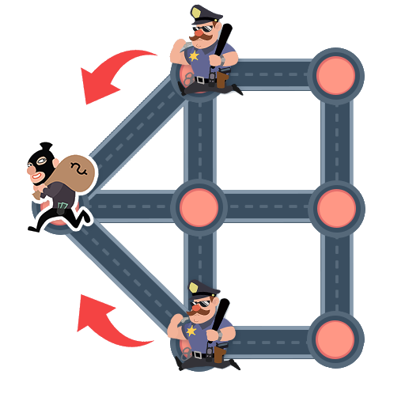
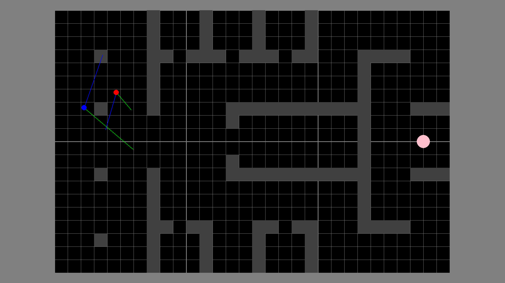
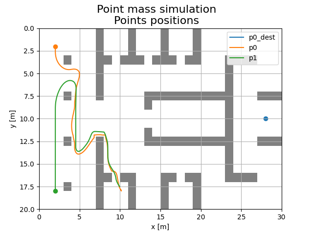

# Introduction

:::: {.columns}
::: {.column width="37%"}

**Cops And Thieves** (*cops and robbers*) is a strategic pursuit-and-evasion game where two opposing agent types operate in a shared environment. Thieves aim to evade capture, while cops patrol, chase, and arrest thieves to maintain order. The game mechanics involve agent coordination, pathfinding, and adaptive decision-making.

:::
::: {.column width="57%"}

{#fig:cat-game-example width=75%}

:::
::: {.column width="6%"}
<!-- this column acts as a margin for the table -->
:::
::::

## Motivation

Comparison of other (probably better) approach for a problem considered previously on engineering studies course *Development Workshop*. Our project – [*Chase model*](https://github.com/mzsuetam/model-poscigowy-sp) – was also implementation of the cops and thieves game.

:::: {.columns}
::: {.column width="52%"}

{width=100%}

:::
::: {.column width="42%"}

{width=100%}

:::
::: {.column width="6%"}
<!-- this column acts as a margin for the table -->
:::
::::

---

{#fig:back width=70%}

As depicted in [@fig:back], we are back to face the challenge of the cops and thieves problem, but this time with a different approach.

## Goal

<!-- @TODO: @Hevagog -->

## Technological Stack

<!-- @TODO: @Hevagog -->
