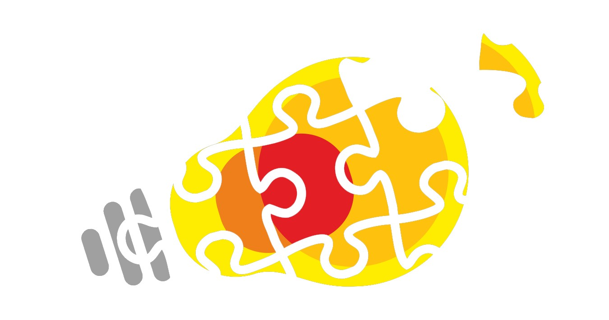
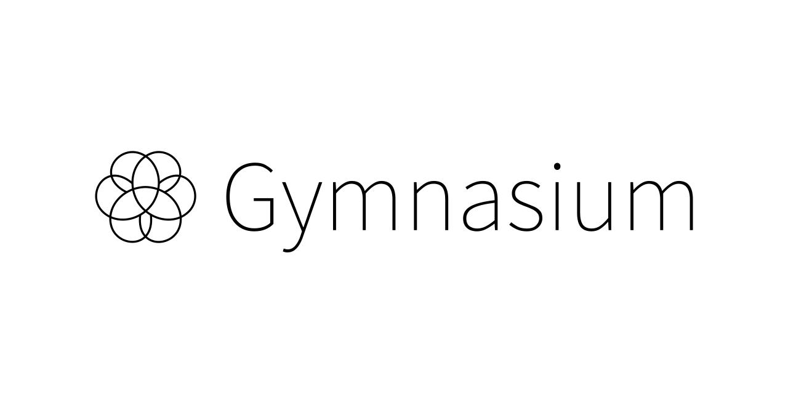
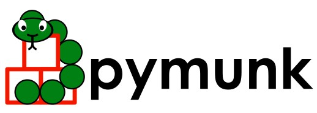

# Introduction

:::: {.columns}
::: {.column width="37%"}

**Cops And Thieves** (*cops and robbers*) is a strategic pursuit-and-evasion game where two opposing agent types operate in a shared environment. Thieves aim to evade capture, while cops patrol, chase, and arrest thieves to maintain order. The game mechanics involve agent coordination, pathfinding, and adaptive decision-making.

:::
::: {.column width="57%"}

{#fig:cat-game-example width=75%}

:::
::: {.column width="6%"}
<!-- this column acts as a margin for the table -->
:::
::::

## Motivation

Comparison of other approach for a problem considered previously on engineering studies course *Development Workshop*. Our project – [*Chase model*](https://github.com/mzsuetam/model-poscigowy-sp) – was also implementation of the cops and thieves game. This project aims to hopefully improve our earlier attempt.

:::: {.columns}
::: {.column width="52%"}

{width=100%}

:::
::: {.column width="42%"}

{width=100%}

:::
::: {.column width="6%"}
<!-- this column acts as a margin for the table -->
:::
::::

---

{#fig:back width=70%}

As depicted in [@fig:back], we are back to face the challenge of the cops and thieves problem, but this time with a different approach.

## Goal

The main goal of this project is to train *environment-agnostic* agents:

- *Cops*: search and chase the thief.
- *Thief*: hide and try not to get caught.

A key aspect for both agents will be their ability to analyze their surroundings and act based on past observations.
For our project we'll initially focus on only 2 agents (1 cop and 1 thief), with possibility of increasing the number of cop agents to observe cooperative behavior and more sophisticated search patterns.

We expect to achieve the following behaviors from agents:

| Agent Type | Expected Description                        |
|------------|---------------------------------------------|
| *Cop*        | Search and chase (if more cops, cooperation)       |
| *Thief*      | Evade capture and hide efficiently           |

## Technological Stack

In our project we intend to use the following frameworks:

- skrl ([@fig:skrl]) for MARL implementation.
- PettingZoo ([@fig:gym]) to guarantee MARL environment standards.
- pymunk ([@fig:pymunk]) as 2D physics engine, complemented by:
    - pygame ([@fig:pygame]) for visualization.

:::: {.columns}
::: {.column width="22%"}
{#fig:skrl width=100%}
:::
::: {.column width="25%"}
{#fig:gym width=100%}
:::
::: {.column width="25%"}
{#fig:pymunk width=100%}
:::
::: {.column width="22%"}
{#fig:pygame width=100%}
:::
::: {.column width="6%"}
<!-- this column acts as a margin for the table -->
:::
:::: 

