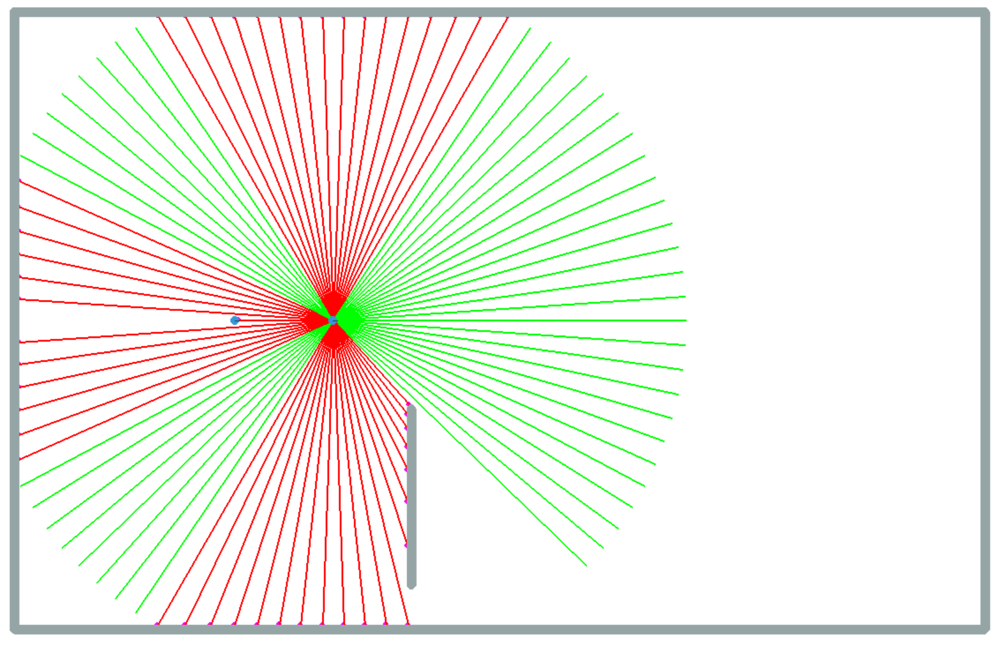
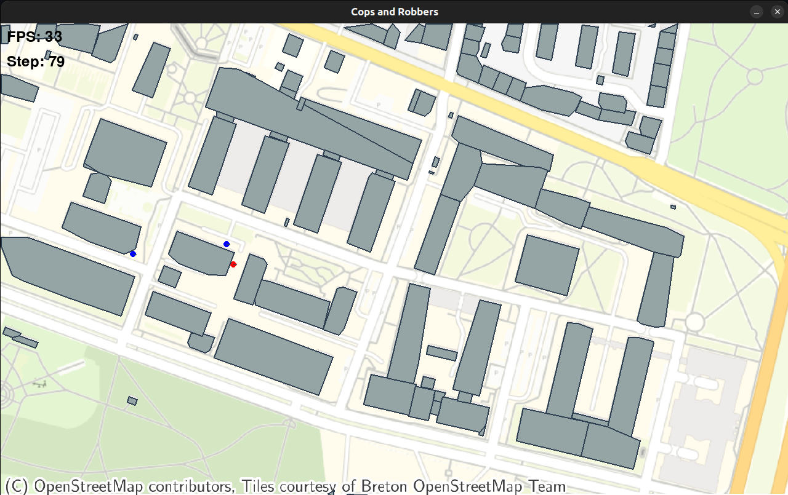

# 1st progress update

## Change log

### Agents

As stated in our first presentation, we have 2 agent types, namely, cops and thieves. Because this part is critical for our project to move forward, we have implemented agent functionality, which covers:

- observation space implemented using vision controller (ray casting),
- action space (enabling movement of our agents in 2D space),
- initial reward function.

---

\vspace{1em}

{width=60%}

---

### Environment

Using *PettingZoo* library we have implemented initial environment, compliant with `Parallel API` in order for all agents to simultaneously perform action and observations.
As part of this we have implemented:

- rendering together with map generation (explained in-depth later on).
- Basic methods needed for *Reinforcement Learning* algorithms (`reset`, `step`, etc. ).
- Shared observation space:
    - needed for learning loop, where agents from the same category share a common observation that represents global information about the environment, 
    - constructed based on their intrinsic priority (i.e. cops wanting to catch a thief), shared observation holds the most important information about their observations.

---

### GUI & Visualization

Apart from a command line interface (CLI) "visualization" (suited for training the agents), we have also implemented a graphical user interface (GUI) that allows us to visualize the environment and the agents' actions. The GUI is presented in [@fig:pr1-gui].

### Environment map generation

We have implemented a simple map generation tool that allows us to create a *map* file based real-world data from OSM.
It generates obstacles for all the buildings in the area and places agents in given locations.
Moreover, it generates a `png` file with a depiction of the area to be used as a background for the GUI.
Figure [-@fig:pr1-gui] presents a screenshot of the GUI with a map of the AGH University of Science and Technology in Kraków, Poland.

---

\vspace{1em}

{#fig:pr1-gui height=90%}
