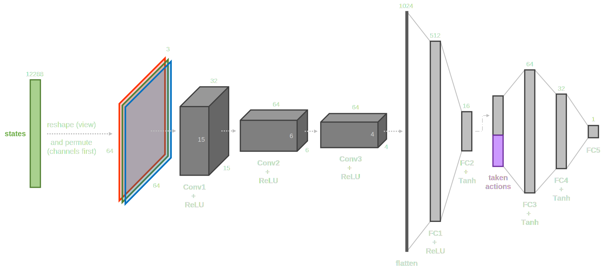
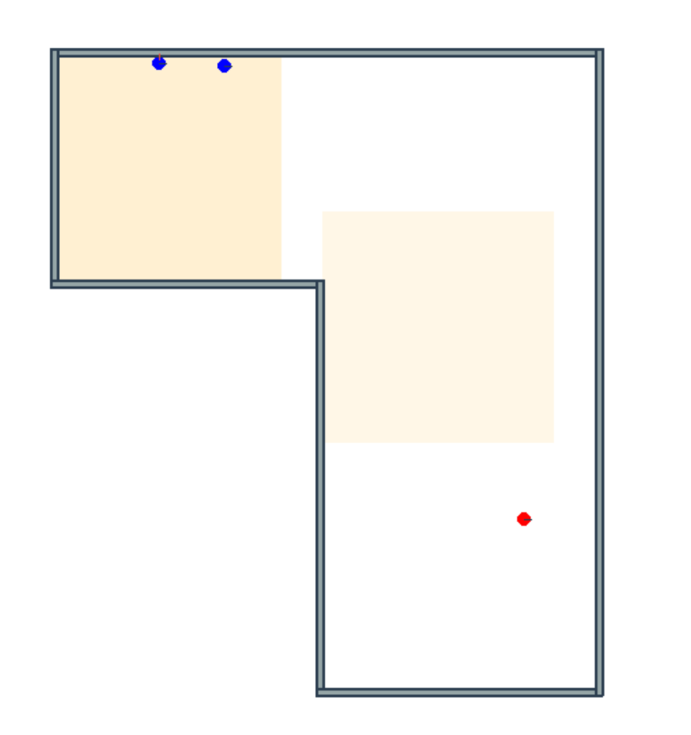
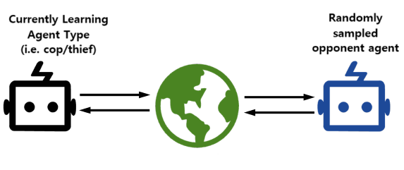
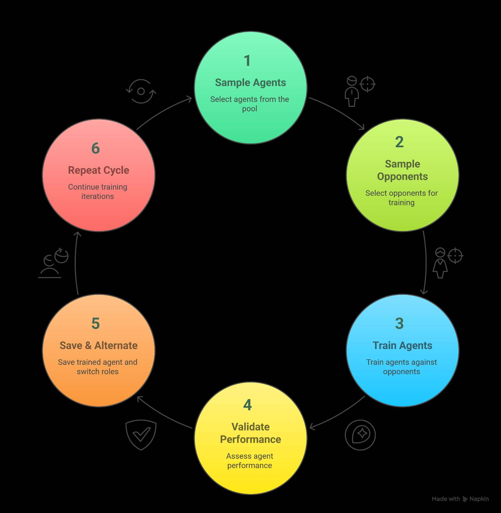

# 3rd Progress Update

## Policy Network

- Acknowledging the spacial nature of the observation space, we have transitioned to a Convolutional Neural Network (CNN) architecture for the policy network.
- Additionally, we have distinguished 2 different channels for the agent's own observations and the shared observations.
    - This implementation involves 2 1D CNN layers.

{width=60%}

---

## Spawn Regions

- We have introduced spawn regions to the environment, allowing agents to spawn in random locations specified within a defined area.
- This feature enhances the diversity of agent spawn points, promoting exploration and reducing the risk of overfitting.

{width=28%}

## Demos of Initial Results

---

## MAPPO Shortcomings and Self-Play

- The MAPPO algorithm has shown promising results in cooperative tasks, but it is not without its challenges.

> The main bottleneck is the sample efficiency of the algorithm, which can lead to slow convergence and suboptimal policies.

- To address this, we are exploring self-play techniques, where agents learn from their own experiences and adapt their strategies based on the evolving dynamics of the environment.

## Naive Self-Play

- In our initial experiments, we implemented a naive self-play approach, where agents learn from their own experiences without any external guidance.
- This method intended for the agents to learn both cooperative and competitive strategies (e.g., behaving as a cop or as a thief).

> Due to the complexity of the models, and the overcomplexity of the environment, this approach has not yielded satisfactory results and was ditched.

## Sampled Self-Play

- We then implemented a sampled self-play approach, where agents are trained in cycles. Each cycle consists of a training phase and a self-play phase.

{width=75%}

---

## Training Sampled Self-Play 

1.  **Sample Agents**: Sample newest agent from the trained pool.
    - If the pool is empty, create a new agent.
2.  **Sample Opponents**: Sample opponent agents from the trained pool.
3.  **Train**: Train the sampled agents against the sampled opponents in the environment.
    - For the training phase, we use the MAPPO algorithm.
    - When training, the policy and value networks are frozen for the opponent agents.
4.  **Validate**: Validate the performance of the sampled agents against earlier sampled opponents.
5.  **Save & Alternate**: Save the trained agent and proceed to learn the next agent of the opposing type.
6.  **Repeat**: Repeat until a predefined number of cycles is reached.

---

{width=45%}

---

## Self-Play Shortcomings

- The sampled self-play approach has shown some promise, but the random nature of the sampling process can lead to inconsistent performance and overfitting to specific opponents.
- Also, training agents based on the oldest agents in the pool can lead to forgetting of the latest strategies and behaviors.
- To address this, we are implementing a more sophisticated sampling strategy.

---

## Prioritized Fictitious Self-Play (PFSP) with Population-play validation

- We are currently implementing a Prioritized Fictitious Self-Play (PFSP) approach, which aims to improve the efficiency of self-play by prioritizing the training of agents based on their performance and the diversity of their strategies.
    - As a measure of performance, we are using Win Rate (WR) and the number of wins.
    - Agents tend to sample opponents with the win rate closest to 50%.
      - This ensures that agents are trained against opponents that are neither too weak nor too strong, promoting balanced learning.
- The PFSP approach also incorporates a population-play validation mechanism, where agents are evaluated against a diverse set of opponents to ensure that the statistics of the training pool are representative of the overall population (mitigates the risk of overfitting to specific opponents and promotes generalization across different strategies).

