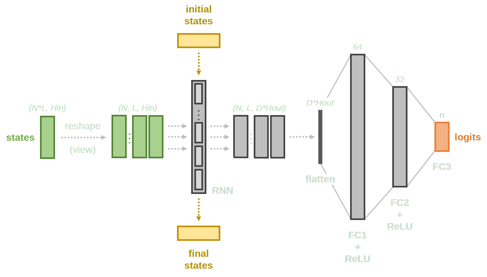
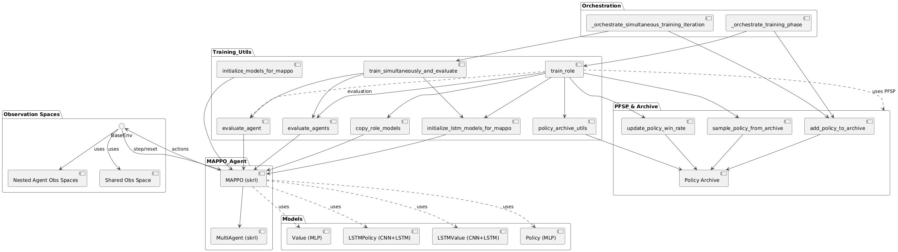

# Final Progress Update

## Goal reminder 

The main goal of this project is to train *environment-agnostic* agents:

- *Cops*: search and chase the thief.
- *Thief*: hide and try not to get caught.

A key aspect for both agents will be their ability to analyze their surroundings and act based on past observations.
For our project we'll initially focus on only 2 agents (1 cop and 1 thief), with possibility of increasing the number of cop agents to observe cooperative behavior and more sophisticated search patterns.

We expect to achieve the following behaviors from agents:

| Agent Type | Expected Description                        |
|------------|---------------------------------------------|
| *Cop*        | Search and chase (if more cops, cooperation)       |
| *Thief*      | Evade capture and hide efficiently           |

## Process

1. Envronment setup
   - pettingzoo compliant with parallelenv parent class. Utilizing pymunk
2. Map setup
3. Agent setup
   - General entity base class
   - observation space, shared observation space
4. Intial mappo integration with skrl
5. Policy/ value network setup
   - first with MLP, then with CNN

---

6. Update to map with spawn regions, limiting overfitting
7. Found limitations of plain mappo, switched to self-play aiding mappo in agent training
8. Further training loop enhancements with better opponent sampling, easing the training process for cop agents
   - first with random sampling
9. Implementing Ficticious Self Play (FSP) [@FictitiousSelfPlay] to improve training efficiency
   - opponent sampling based on agent performance- win rate closest to 50% 
10. LSTM implementation for policy/value networks.

## Current setup

### Reward function update

For RL and MAPPO specifically, the reward function should be scaled between -1 and 1.

---

### Thief Reward Function

The reward $r_\text{thief}$ is:

$$r_{\text{thief}} = \begin{cases} -1 & \text{if } t_0 \text{ (cop terminated)} \\ 1 & \text{if } t_1 \text{ (thief terminated)} \\ \tanh\left(\frac{d_{\text{min}} - 100}{50}\right) \div 10 & \text{if cop is visible} \\ 0.15 & \text{otherwise} \end{cases}$$

Where:

- $o$ = observation (with keys `"distance"` and `"object_type"`)
- $t = (\text{is\_terminated\_cop}, \text{is\_terminated\_thief})$
- $\text{cop\_mask} = (o[\text{"object\_type"}] == \text{ObjectType.COP.value})$
- $d_{\text{min}} = \min(o[\text{"distance"}][\text{cop\_mask}])$

---

### Cop Reward Function

The reward $r_{\text{cop}}$ is:

$$r_{\text{cop}} = \begin{cases} 1 & \text{if } t_0 \text{ (cop terminated)} \\ -1 & \text{if } t_1 \text{ (thief terminated)} \\ \text{time\_penalty} + 1.5 \cdot e^{-d_{\text{min}}/50} & \text{if thief is visible} \\ \text{time\_penalty} - 0.02 & \text{otherwise} \end{cases}$$

Where:

* $o$ = observation (with keys `"distance"` and `"object_type"`)
* $t = (\text{is\_terminated\_cop}, \text{is\_terminated\_thief})$
* $\text{thief\_mask} = (o[\text{"object\_type"}] == \text{ObjectType.THIEF.value})$
* $d_{\text{min}} = \min(o[\text{"distance"}][\text{thief\_mask}])$
* $\text{time\_penalty} = -0.02$

---

### Network (updated – LSTM)

- To remember the previous observations, we use LSTM networks.
- This allows the agent to learn from past observations and make better decisions based on the history of its actions and observations, e.g. when the thief hides behind a wall, the cop can remember that and search that area again later.

---

{height=80%}

---

### Learning infrastructure

- We use a custom learning infrastructure based on skrl extended with Prioritized Fictitious Self-play (PFSP)  ([@FictitiousSelfPlay]) to balance the learning process of a policeman and a thief.

## Comparison with OPEN AI 

| Feature                | Our Approach                                   | OpenAI [@baker2020emergenttoolusemultiagent]|
|------------------------|------------------------------------------------|-------------------------------------|
| Environment            | 2D physics-based (PyMUNK)                      | 3D physics-based (MUJOCO)           |    
| Network Architecture   | LSTM + CNN                                     | LSTM + self-attention mechanisms    |
| Training Method        | MAPPO + PFSP (Prioritized Fictitious Self-Play)| PPO + GAE (Generalized Advantage Estimation) |
| Cooperative Behavior   | Multi-agent, supports cop (or thief) cooperation | Multi-agent, supports cop (or thief) cooperation |
| Learning time          | $~10^6$ episodes                               | $~132 * 10^6$ episodes              |
| Final result           | unattained, on the right track                 | achieved                            |
| Opponent Sampling      | Performance-based (win rate ~50%)              | Random or fixed                     |

## Conclusions

- Due to the high computational cost of MAPPO and the sample inefficiency, the training required for observing significant behaviors is quite long. OpenAI [@baker2020emergenttoolusemultiagent] required $3-4 \cdot 10^8$ episodes to achieve significant chase and hide behaviors.
    - An important thing to note here is that their training was based on a more sample efficient attention-based algorithm, whereas our approach is based on a more sample inefficient PPO-based algorithm. 
- agent training is ongoing, but we have already observed some interesting behaviors:
  - the cop is able to chase the thief and catch it in some cases
  - the thief is able to hide and evade capture in some cases

---

\vspace{1em}

### Live demo

{height=80%}

## Future work

- Train the agents further to achieve more complex behaviors
- Utilize maps as a curriculum learning platform
  - Create more complex maps with different layouts and obstacles
  - Use the maps to train the agents in a curriculum learning fashion, e.g. start with simple maps and gradually increase the complexity
- Improve the MAPPO training process
  - Improve the reward function to encourage more complex behaviors
- Improve the agent architecture
    - Add more complex features to the agent architecture, e.g. attention mechanisms
